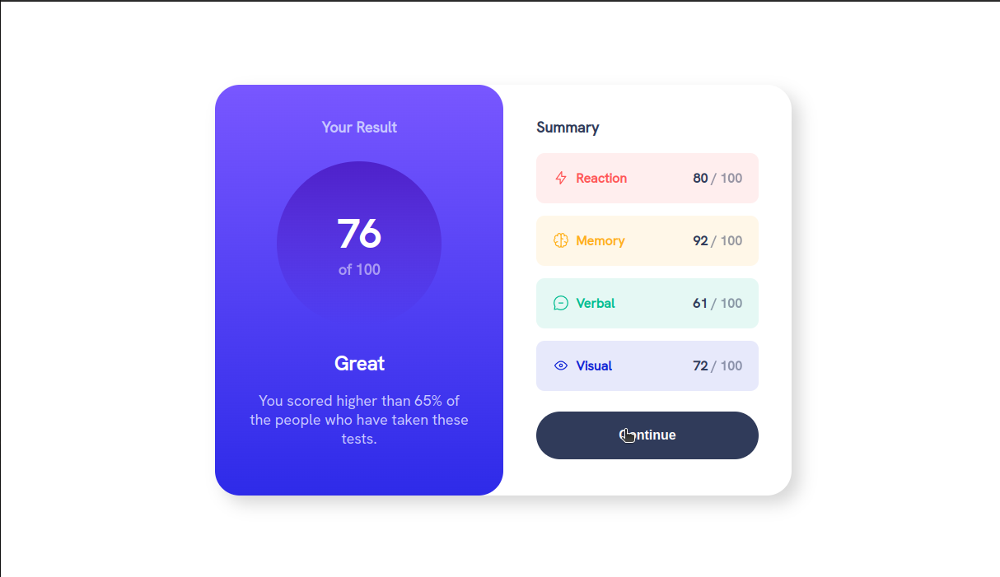

# Frontend Mentor - Results summary component solution

This is a solution to the [Results summary component challenge on Frontend Mentor](https://www.frontendmentor.io/challenges/results-summary-component-CE_K6s0maV). Frontend Mentor challenges help you improve your coding skills by building realistic projects. 

## Table of contents

- [Overview](#overview)
  - [The challenge](#the-challenge)
  - [Screenshot](#screenshot)
  - [Links](#links)
- [My process](#my-process)
  - [Built with](#built-with)
  - [What I learned](#what-i-learned)

## Overview

### The challenge

Users should be able to:

- View the optimal layout for the interface depending on their device's screen size
- See hover and focus states for all interactive elements on the page

### Screenshot

### Links

- Solution URL: [Add solution URL here](https://your-solution-url.com)
- Live Site URL: [Add live site URL here](https://your-live-site-url.com)

## My process

### Built with

- Flexbox
- CSS Grid
- Mobile-first workflow
- Vue - JS library

### What I learned

In building projects, you learn new things even if there was no one to teach you. In this project I learnt a new process of building websites that I found to be efficient. In this section, I'll cover the new process that I found.

The process involves developing the project in the following order:

1. The HTML markup.

This step involves writing the HTML of your website before any scripts or styles. This helped to write good content for the site. And it helped to isolate each step in building the site.

2. The script.

In writing the script next, you can understand the websites interactivity. Styling the site dramatically increases the size of the project. Doing the script immediately after the HTML makes it a little easier to build the site.

3. The mobile designs.

Developing mobile designs before any other design makes your website efficient on mobile devices. Unlike desktops, mobile devices have limited resources. To ensure the website works well on mobile, you need to make the site as efficient as possible.

4. The next design size and so on.

CSS provides a `@media query` command that you can use in creating designs meant for specific screen sizes. Using `@media query` for larger designs helps the device understand what size the design is meant for.

You just read about the new-found process of building web applications that I discovered while building the application. You can look into the project to see how I integrated each step in building the project.